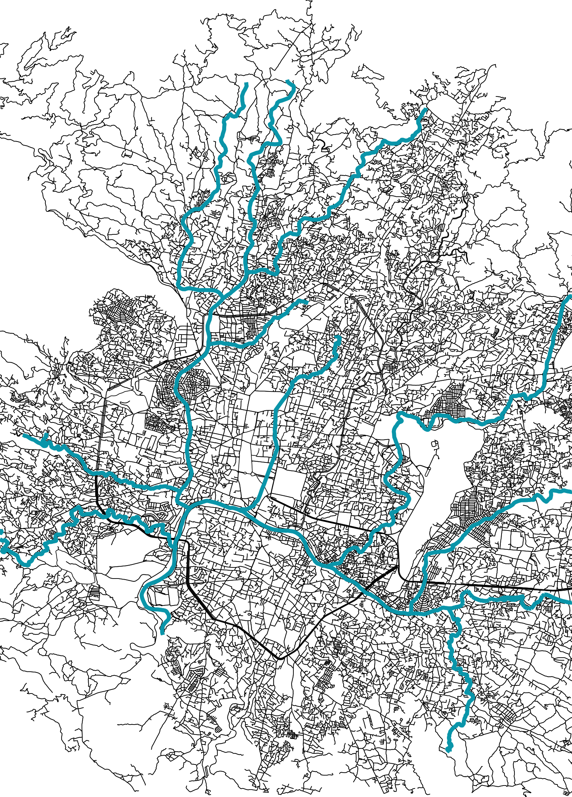

# Plot Artistic Open Street Map using Python 



### Installation

#### Install Python using PyENV and use UV as package manager. 

1. [Pyenv](https://github.com/pyenv/pyenv)
2. [UV](https://github.com/astral-sh/uv)

```bash
uv sync
```


### Usage
```Python
python src/pychic_map.py --lat 27.7172 --lon 85.3240 --radius 10000 --shape box --river True --output ./kathmandu.png     
```